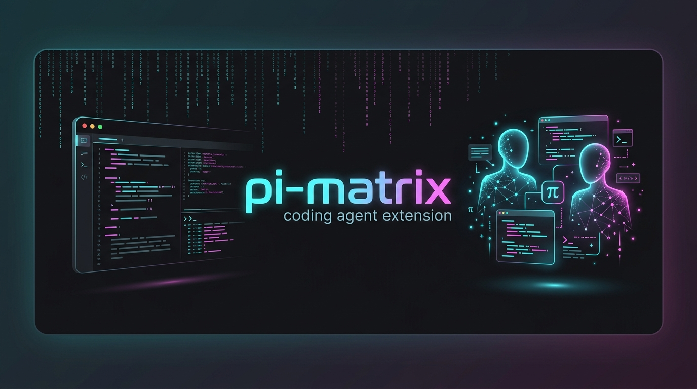
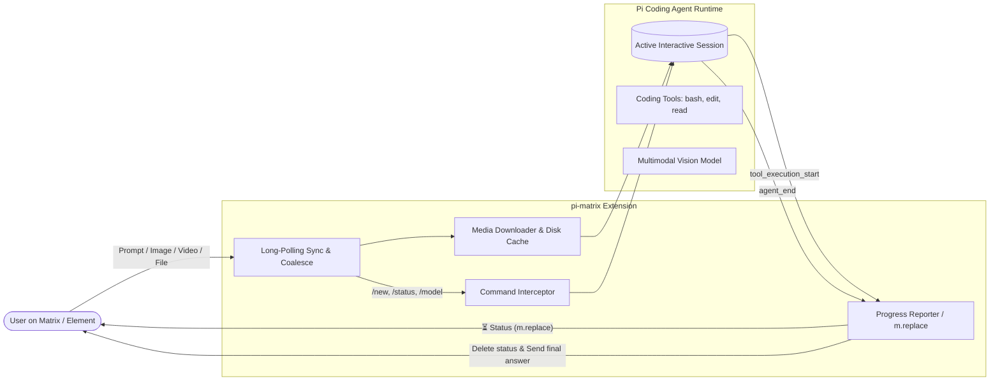

<div align="center">



# pi-matrix

**Native, high-performance, zero-token-overhead Matrix bridge extension for [Pi Coding Agent](https://github.com/earendil-works/pi-coding-agent).**

[](LICENSE)
[](https://github.com/earendil-works/pi-coding-agent)
[](https://matrix.org)
[](https://www.typescriptlang.org/)

</div>

---

## ⚡ Overview

`pi-matrix` is a dedicated bridge extension engineered specifically for **Pi Coding Agent**. Unlike traditional bots that spin up separate API sessions or wrap messages in hundreds of tokens of subagent instructions, `pi-matrix` directly injects messages into your active Pi TUI session, giving you full access to your agent, its workspaces, tools, and subscriptions seamlessly over Matrix.



---

## ✨ Features

- **🚀 Direct Session Injection (Zero Token Bloat)**: Messages are dispatched directly via `pi.sendUserMessage()` with `{ deliverAs: "followUp" }`. No system-prompt wrapping, no wasted context tokens, and no concurrency crashes.
- **⏱️ Live Progress Reporter with Cooldown**: Hooks into Pi lifecycle events (`turn_start`, `tool_execution_start`, `tool_execution_end`) to report what the agent is doing (`⚙️ Running bash: ...`, `📖 Reading ...`, `✏️ Editing ...`, `🔍 Searching ...`) with a debounced cooldown (default: `5s`).
- **🧹 In-Place Updates (`m.replace`) & Auto-Cleanup**: Status updates are edited in-place inside a single Matrix message (MSC2676) so chat rooms never get spammed. When Pi finishes, the temporary progress message is automatically redacted (deleted), leaving only your prompt and the final response.
- **🖼️ Comprehensive Multimodal Media**:
  - **Images (`m.image`)**: Downloads media, passes Base64 directly into Pi's multimodal vision model, and saves the file locally in `~/.pi/agent/media/`.
  - **Videos (`m.video`)**: Downloads to local disk, extracts metadata, and notifies Pi of the local path for tool analysis.
  - **Audio (`m.audio`)**: Downloads and caches audio files locally for agent inspection.
  - **Files / Documents (`m.file`)**: Saves documents/code to disk and generates syntax-highlighted code previews for text files under 64KB.
- **🔗 Intelligent Batch Coalescing**: Automatically merges rapid-fire text captions and media events from Matrix clients into a single multimodal turn.
- **💾 Disk-Backed Sync Token**: Automatically saves `next_batch` to `~/.pi/agent/matrix_sync_token` so restarts never replay past messages.
- **🛠️ Remote Control Slash Commands**: Control your agent straight from Matrix chat without touching your terminal:
  - `/new` or `/reset`: Instantly resets the session via `ctx.newSession()` without prompting the LLM.
  - `/status`: Displays connection state, active model, thinking budget, and exact session token/message counts.
  - `/model [name]`: Inspects available models or dynamically switches models.
  - `/thinking [level]`: Adjusts reasoning depth (`off`, `low`, `medium`, `high`, `max`).
  - `/compact`: Triggers context compaction.
  - `/help`: Lists available commands.
- **🌐 Persian & Bilingual BiDi Formatting**: Automatically wraps Persian text lines in right-to-left (`dir="rtl"`) tags and code blocks in left-to-right (`dir="ltr"`).
- **🧠 Clean Output**: Strips `<think>...</think>` tags automatically before delivering replies.
- **👀 Fast Reactions**: Immediate acknowledgment reaction (`👀`) and task completion checkmark (`✅`).
- **🔔 Hardened Notifications**: Desktop notifications via `execFile("notify-send", ...)` with zero shell-interpolation risks.

---

## 📦 Installation

### 1. Declarative (NixOS & Home-Manager)

Add the extension and declarative configuration into your Home-Manager setup:

```nix
# modules/home/ai/pi/default.nix
{ pkgs, ... }:
let
  piAgentDir = ".pi/agent";
in
{
  home.file."${piAgentDir}/extensions/pi-matrix.ts".source =
    builtins.fetchurl {
      url = "https://raw.githubusercontent.com/surtr85/pi-matrix/main/index.ts";
      # or reference a local clone/submodule
    };

  home.file."${piAgentDir}/matrix.json".text = builtins.toJSON {
    homeserver = "https://matrix.example.com";
    accessToken = "YOUR_MATRIX_ACCESS_TOKEN";
    botUserId = "@pi_bot:matrix.example.com";
    allowedUsers = [ "@you:matrix.example.com" ];
    autoStart = true;
    useSubagent = false;
    progressCooldownSeconds = 5;
    progressMode = "edit";
  };
}
```

### 2. Manual Installation

Clone or copy `index.ts` into your local Pi extensions directory:

```bash
mkdir -p ~/.pi/agent/extensions
curl -fsSL https://raw.githubusercontent.com/surtr85/pi-matrix/main/index.ts \
  -o ~/.pi/agent/extensions/pi-matrix.ts
```

Create your configuration file at `~/.pi/agent/matrix.json`:

```json
{
  "homeserver": "https://matrix.example.com",
  "accessToken": "syt_xxxxxxxxxxxxxxxxxxxx",
  "botUserId": "@bot:matrix.example.com",
  "allowedUsers": [
    "@your_username:matrix.example.com"
  ],
  "autoStart": true,
  "progressCooldownSeconds": 5,
  "progressMode": "edit"
}
```

Start Pi in your terminal:

```bash
pi
```

You will see:
```text
Matrix Bridge connected (Direct Mode)
```

---

## ⚙️ Configuration Reference (`matrix.json`)

| Option | Type | Default | Description |
| :--- | :---: | :---: | :--- |
| `homeserver` | `string` | `"https://matrix.org"` | Matrix homeserver base URL. |
| `accessToken` | `string` | `""` | Bot account access token. |
| `botUserId` | `string` | `""` | The bot user ID (e.g. `@miku:matrix.kurisu.ir`). |
| `allowedUsers` | `string[]` | `[]` | Allowlist of user IDs permitted to interact with the bot. Leave empty for open access. |
| `autoStart` | `boolean` | `true` | Whether to automatically start listening when Pi opens. |
| `progressCooldownSeconds`| `number` | `5` | Minimum seconds between progress updates to avoid notification spam. |
| `progressMode` | `"edit" \| "message"` | `"edit"` | `"edit"` updates the progress in-place via MSC2676; `"message"` sends new messages. |
| `useSubagent` | `boolean` | `false` | When `false`, messages execute directly in Pi for minimum token consumption. |

---

## 🎮 Interactive Slash Commands

Control your agent remotely from any Matrix client:

| Command | Description |
| :--- | :--- |
| `/new` or `/reset` | Resets the conversation and starts a new session immediately. |
| `/status` | Shows connection status, active model, thinking level, and token metrics. |
| `/model [id]` | Shows the active model or switches to another available model. |
| `/thinking [level]`| Sets thinking/reasoning depth (`off`, `low`, `medium`, `high`, `max`). |
| `/compact [prompt]`| Triggers context compaction with optional instructions. |
| `/help` | Shows the command cheat sheet. |

---

## 📁 Media Storage

All received media (images, videos, voice notes, PDFs, code archives) are securely saved to:
```text
~/.pi/agent/media/<timestamp>_<filename>
```
Pi is automatically informed of the file's exact location, allowing it to inspect or process files locally using its command-line tools (`read`, `bash`, Python scripts, ImageMagick, etc.).

---

## 📄 License

Distributed under the [MIT License](LICENSE).
