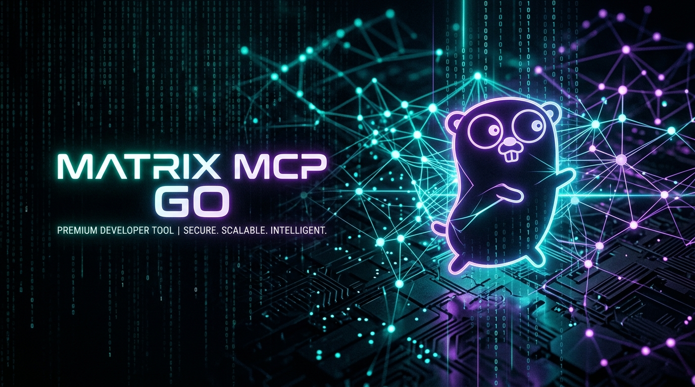

<p align="center">
  
</p>

<p align="center">
  <a href="https://golang.org"></a>
  <a href="https://matrix.org"></a>
  <a href="flake.nix"></a>
  <a href="https://modelcontextprotocol.io"></a>
  <a href="LICENSE"></a>
</p>

<p align="center">
  <strong>Universal, high-performance Model Context Protocol (MCP) server bridging autonomous AI agents to the decentralized Matrix network.</strong>
  <br />
  <em>Zero hardcoded secrets &bull; Pure-Go End-to-End Encryption &bull; AST BiDi Formatting &bull; Human-in-the-Loop &bull; Dual Stdio/SSE Transport</em>
</p>

---

## ⚡ Highlights

- 🔐 **Pure-Go E2EE Cryptography:** Powered by `mautrix-go` with pure-Go Olm/Megolm (`-tags goolm`). Zero vulnerable legacy C `libolm` shared library dependencies.
- 💬 **Human-in-the-Loop (`matrix_ask_human`):** Agents can pause execution, prompt an authorized human over a Matrix thread, maintain active typing indicators, and automatically resume once answered.
- 🌐 **AST-Level Bidirectional (BiDi) Markdown:** Seamless Arabic/Persian RTL and English LTR rendering using Goldmark AST transformation. Fenced code blocks and identifiers remain strictly LTR.
- 🔄 **Dual Transport Architecture:** Run locally as an agent subprocess via **Stdio** (with guaranteed JSON-RPC isolation on `os.Stdout`) or deploy as a persistent remote network daemon via **HTTP/SSE**.
- 🛡️ **Role-Based Access Control (RBAC):** Built-in sender allowlisting to protect agents against prompt injection and malicious bot manipulation.
- 💾 **Embedded Persistence:** SQLite storage in WAL mode preserves sync batch tokens, crypto sessions, and device credentials across reboots without creating ghost sessions.
- 📊 **Prometheus Observability:** Native `/metrics` endpoint tracking tool latency histograms, message counts, and sync loop throughput.
- ❄️ **Hermetic Nix Packaging:** First-class `flake.nix` providing instant zero-install execution (`nix run`) and reproducible builds (`nix build`).

---

## 🏛 Architecture

```
+-------------------------------------------------------------------------------+
|                                AI AGENTS                                      |
|    Claude Desktop  /  Pi Agent  /  Cursor  /  Antigravity  /  Devin / Custom  |
+-------------------------------------------------------------------------------+
           |                                                      ^
           | MCP JSON-RPC (Stdio / SSE)                           |
           v                                                      |
+-------------------------------------------------------------------------------+
|                       matrix-mcp-go Gateway Daemon                            |
|                                                                               |
|  +-------------------------------------------------------------------------+  |
|  |                           MCP Server Layer                              |  |
|  |   - Stdio Transport (Log-isolated to stderr, clean stdout JSON-RPC)     |  |
|  |   - HTTP/SSE Server (/sse, /message, /metrics, /healthz)                |  |
|  |   - Tools: send_message, ask_human, reaction, upload, list_rooms        |  |
|  |   - Resources: matrix://rooms/joined                                    |  |
|  +-------------------------------------------------------------------------+  |
|                                     |                                         |
|  +----------------------------------+--------------------------------------+  |
|  | Formatter & BiDi Engine          | Security & RBAC                      |  |
|  |  - Goldmark AST Markdown parser  |  - Allowlist user filtering          |  |
|  |  - Auto RTL/LTR detection        |  - Malicious prompt drop             |  |
|  |  - LTR-enforced code blocks      |  - Thread binding & verification     |  |
|  +----------------------------------+--------------------------------------+  |
|                                     |                                         |
|  +-------------------------------------------------------------------------+  |
|  |                       Matrix Engine (mautrix-go)                        |  |
|  |   - Pure Go Olm/Megolm E2EE (goolm, memory-safe, zero C olm)            |  |
|  |   - Resilient Sync Loop (Exponential backoff + M_LIMIT_EXCEEDED retry)  |  |
|  |   - Embedded SQLite Persistence (WAL mode, crypto state, batch tokens)  |  |
|  |   - Human-in-the-Loop Reply Registry with Live Typing Indicators        |  |
|  +-------------------------------------------------------------------------+  |
+-------------------------------------------------------------------------------+
                                      |
                           Matrix Client-Server API
                                      v
+-------------------------------------------------------------------------------+
|                     Matrix Homeserver (Synapse / Dendrite)                   |
|                        Encrypted Rooms, Threads, Media                        |
+-------------------------------------------------------------------------------+
```

---

## 🚀 Quickstart

### Option 1: Nix Flake (Recommended)

Run directly without installing anything:
```bash
nix run github:surtr85/matrix-mcp-go -- -config config.yaml
```

Build the standalone binary:
```bash
nix build github:surtr85/matrix-mcp-go
./result/bin/matrix-mcp-go -version
```

Enter reproducible development shell:
```bash
nix develop
go test -tags goolm -v ./...
```

### Option 2: Go Toolchain

```bash
git clone https://github.com/surtr85/matrix-mcp-go.git
cd matrix-mcp-go
go build -tags goolm -o bin/matrix-mcp-go ./cmd/matrix-mcp-go
```

---

## ⚙️ Configuration Reference

Configuration can be specified using a YAML file or environment variables (`MATRIX_MCP_*`).

```bash
cp config.example.yaml config.yaml
```

### `config.yaml`

```yaml
matrix:
  # Matrix Homeserver URL
  homeserver_url: "https://matrix.org"

  # Bot User ID
  user_id: "@myagent:matrix.org"

  # Authentication: provide either access_token OR password
  access_token: "syt_your_matrix_access_token"
  # password: "your-secret-password"

  # Persistent Device ID (prevents spawning ghost sessions on restarts)
  device_id: "matrix-mcp-gateway"

  # SQLite database path for session/crypto/state persistence
  db_path: "data/matrix-mcp.db"

  # Optional encryption key for crypto pickle storage
  pickle_key: "your-secret-pickle-key"

  # Security & RBAC: Allowlisted Matrix users.
  # Use ["*"] or leave empty to allow all users.
  allowed_users:
    - "@admin:matrix.org"
    - "@developer:matrix.org"

mcp:
  server_name: "matrix-mcp-go"
  server_version: "0.1.0"

  # Transport: "stdio" (local agent) or "sse" (network daemon)
  transport: "stdio"

  # SSE network settings
  listen_address: "0.0.0.0"
  http_port: 8080

log:
  level: "info"     # debug, info, warn, error
  format: "json"    # json, text (all stdio logs go to stderr)
```

### Environment Variable Overrides

All options support environment variable overrides with prefix `MATRIX_MCP_`:

```bash
export MATRIX_MCP_MATRIX__HOMESERVER_URL="https://matrix.org"
export MATRIX_MCP_MATRIX__USER_ID="@agent:matrix.org"
export MATRIX_MCP_MATRIX__ACCESS_TOKEN="syt_secret_token"
export MATRIX_MCP_MCP__TRANSPORT="stdio"
export MATRIX_MCP_LOG__LEVEL="debug"
```

---

## 🤖 AI Agent Integration

### Claude Desktop (`claude_desktop_config.json`)

```json
{
  "mcpServers": {
    "matrix": {
      "command": "/path/to/matrix-mcp-go/result/bin/matrix-mcp-go",
      "args": [
        "-config", "/path/to/matrix-mcp-go/config.yaml",
        "-transport", "stdio"
      ]
    }
  }
}
```

### Cursor / Antigravity / Pi Agent

```json
{
  "name": "matrix",
  "type": "stdio",
  "command": "matrix-mcp-go",
  "args": ["-config", "config.yaml"]
}
```

### Remote Network Deployment (SSE Mode)

Run the server as a systemd service or container:
```bash
./result/bin/matrix-mcp-go -config config.yaml -transport sse
```

And connect any remote agent:
```json
{
  "name": "matrix-remote",
  "type": "sse",
  "url": "http://10.0.0.5:8080/sse"
}
```

---

## 🛠 Available MCP Tools

| Tool | Description | Parameters |
| :--- | :--- | :--- |
| `matrix_send_message` | Sends formatted Markdown with auto BiDi RTL/LTR to room or thread | `room_id` (str), `message` (str), `thread_id` (opt) |
| `matrix_wait_message` | Long-polls for incoming messages from authorized users for 24/7 autonomous bot loops | `room_id` (opt), `thread_id` (opt), `timeout_seconds` (opt, default: 120, max: 600) |
| `matrix_ask_human` | Prompts a human in Matrix, displays typing indicator, and awaits reply | `room_id` (str), `question` (str), `thread_id` (opt), `timeout_seconds` (opt) |
| `matrix_send_reaction` | Reacts to an event with an emoji | `room_id` (str), `event_id` (str), `emoji` (str) |
| `matrix_upload_media` | Uploads local file to Matrix content repo and returns `mxc://` URI | `file_path` (str) |
| `matrix_list_rooms` | Lists joined rooms with names, topics, and member counts | None |

### Universal Autonomous Agent Loop Pattern (`matrix_wait_message`)

In standard MCP environments (Claude Desktop, Cursor, Antigravity, Pi Agent, etc.), the MCP server cannot forcefully inject prompts into the host agent's session.
To turn any AI agent into an autonomous, 24/7 responsive Matrix bot, `matrix_wait_message` implements universal inbound long-polling:

```
+-------------------------------------------------------------------------+
|                           Agent Polling Loop                            |
|                                                                         |
|  1. Call `matrix_wait_message(timeout_seconds: 120)`                     |
|     └── Holds execution until an authorized Matrix user sends a message |
|  2. On message:                                                         |
|     ├── Gateway auto-acknowledges with reaction `👀`                    |
|     ├── Gateway turns on typing indicator                               |
|     └── Tool returns `{ "has_message": true, "message": "...", ... }`   |
|  3. Agent processes message with LLM                                    |
|  4. Agent calls `matrix_send_message` with response                     |
|  5. Loop back to step 1                                                 |
+-------------------------------------------------------------------------+
```

#### Response Format

When a message is received:
```json
{
  "has_message": true,
  "room_id": "!room:example.com",
  "event_id": "$event_id",
  "thread_id": "$thread_id",
  "sender": "@user:example.com",
  "message": "text content",
  "timestamp": 1726945200000
}
```

When timed out (clean return allowing agent turn renewal):
```json
{
  "has_message": false,
  "message": "No new messages received within timeout window."
}
```

### Available MCP Resources
- `matrix://rooms/joined` — Returns live snapshot of joined rooms and summaries.

---

## 🤖 Agent Integrations & Bridges

In addition to the standard MCP server, `matrix-mcp-go` includes first-class integrations for interactive AI coding harnesses:

### 1. Pi Coding Agent Native Extension (`integrations/pi/`)
A dedicated high-performance extension for [Pi Coding Agent](https://github.com/earendil-works/pi-coding-agent):
- **Zero Token Overhead**: Directly injects Matrix messages into Pi via `pi.sendUserMessage()` without bloated subagent prompts.
- **Live Progress Reporting with Cooldown**: Hooks `tool_execution_start` (`bash`, `read`, `write`, `edit`) and `turn_start` to announce background activities with a debounced cooldown (default: 5s).
- **In-Place Live Updates (`m.replace`)**: Updates progress in-place via MSC2676 without spamming notifications.
- **BiDi RTL/LTR & Sanitization**: Strips thinking tags (`<think>...</think>`), wraps Persian in RTL and code blocks in LTR.
- **Matrix Slash Commands**: Remote control via `/status`, `/new`, `/model`, `/thinking`, `/compact`, `/help`.
- See [`integrations/pi/README.md`](integrations/pi/README.md) for full setup instructions.

### 2. Standalone Agent Polling Daemon (`scripts/matrix_agent_listener.py`)
A lightweight, zero-dependency Python daemon that listens for Matrix events, reacts with `👀`, invokes a local CLI agent (`pi -p`), and replies with `✅`.

---

## 🧪 Testing & Verification

```bash
# Run all unit and integration tests
nix develop --command go test -tags goolm -v ./...

# Run formatter benchmarks
nix develop --command go test -tags goolm -bench=. ./internal/format

# Run linter
nix develop --command golangci-lint run --build-tags goolm ./...
```

---

## 📄 License

Distributed under the MIT License. See [`LICENSE`](LICENSE) for details.
